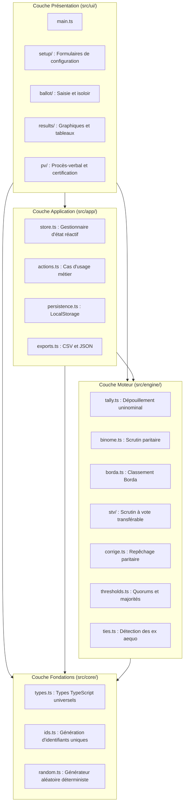

# Architecture en couches

L'application suit une stricte séparation des responsabilités articulée autour de 4 couches hiérarchisées, unidirectionnelles et étanches.

## Schéma d'ensemble

## Règles de dépendance

1. **Sens unique strict** :
   - `ui` peut importer de `app`, `engine`, et `core`.
   - `app` peut importer de `engine` et `core`, mais **jamais** de `ui`.
   - `engine` peut importer de `core`, mais **jamais** de `app` ni de `ui`.
   - `core` n'importe aucun autre module de l'application.
2. **Pureté du moteur (`engine`)** :
   - Les fonctions de calcul sont 100 % pures : pour les mêmes entrées, elles retournent exactement le même résultat.
   - Aucun effet de bord, aucun appel direct au DOM, aucune persistance, aucun accès à l'horloge système sans injection.
3. **Limite de 200 lignes par fichier** :
   - Tout module dépassant 200 lignes doit être découpé en sous-modules spécialisés rassemblés dans un répertoire avec un `index.ts`.

## Rôle détaillé de chaque couche

### 1. `core/` (Fondations)
- Définit les modèles et types TypeScript utilisés dans tout le projet (`Candidat`, `Binome`, `Bulletin`, `ElectionState`, etc.).
- Fournit des utilitaires cryptographiques et aléatoires déterministes (PRNG basé sur seed pour le tirage au sort reproductible).

### 2. `engine/` (Moteur algorithmique)
- Implémente les règles électorales officielles de chaque modalité.
- Indépendant de l'interface graphique : exécutable indifféremment dans le navigateur, en Node.js, ou dans une suite de tests unitaires.
- Reçoit des données brutes (bulletins, candidats, paramètres) et renvoie un résultat immuable.

### 3. `app/` (Application et État)
- Gère le cycle de vie de l'élection via un Store réactif minimaliste (`store.ts`).
- Orchestre la sauvegarde et la restauration locale (`persistence.ts`) dans le `localStorage`.
- Assure la conversion et l'exportation des données en formats standards (`exports.ts` pour JSON et CSV).

### 4. `ui/` (Interface utilisateur)
- Composants Vanilla TypeScript sans dépendance à un framework lourd (React/Vue/Angular).
- Rendu dynamique du DOM, écoute des interactions utilisateurs, gestion du clavier et de la synthèse vocale.
- Organisation en sous-dossiers thématiques : `setup/`, `ballot/`, `results/`, `pv/`.

---
*Lien connexe : [Modèle de données](Modele-de-donnees.md) · [État et persistance](Etat-et-persistance.md)*
