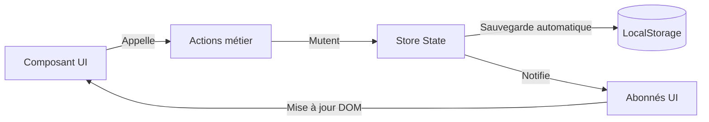

# Gestion de l'état et persistance

L'application utilise un patron de gestion d'état réactif unidirectionnel inspiré de Redux/Flux, sans aucune dépendance externe.

## Le Store réactif (`src/app/store.ts`)

Le store centralise l'état courant et notifie les composants abonnés dès qu'une mutation intervient.

### Méthodes principales du Store

- `getState()` : retourne une vue en lecture seule de l'état actuel (`ElectionState`).
- `subscribe(listener)` : enregistre un callback déclenché après chaque changement d'état.
- `update(updater)` : applique une mutation immuable à l'état et déclenche la persistance.

---

## Persistance locale (`localStorage`)

Toutes les données du scrutin sont persistées localement dans le navigateur de l'école ou de la mairie.

### Clés de stockage

| Clé | Rôle |
| :--- | :--- |
| `cme_scrutin_v1` | Scrutin en cours (configuration, candidats, bulletins) |
| `cme_audience` | Audience active (`kids` ou `adults`) |
| `cme_scrutin_history_v1` | Archive des 10 derniers scrutins finalisés |

### Robustesse et intégrité

- **Sauvegarde synchrone** : chaque bulletin inséré déclenche immédiatement la sérialisation JSON dans le `localStorage`. En cas de fermeture inopinée de la page, rafraîchissement ou panne de batterie, aucun vote n'est perdu.
- **Dépouillement déterministe** : les résultats ne sont pas stockés. Au chargement, la liste des bulletins bruts est recalculée par le moteur (`engine/`), garantissant l'absence de désynchronisation.
- **Fonctionnement hors ligne (offline-first)** : aucune requête réseau n'est requise. L'application est totalement autonome dans les salles de classe sans connexion Internet.

---

## Import / Export (`src/app/exports.ts`)

Pour faciliter le partage, l'archivage municipal et l'audit :

1. **Export JSON complet** : télécharge l'état intégral du scrutin, ré-importable sur un autre ordinateur.
2. **Export CSV des bulletins** : tableau détaillant chaque bulletin (identifiant, horodatage, choix) pour analyse tableur (Excel, LibreOffice Calc).
3. **Export CSV des résultats** : synthèse du dépouillement, voix par candidat, pourcentages et statuts d'élection.

---
*Lien connexe : [Modèle de données](Modele-de-donnees.md) · [Couches logicielles](Couches.md)*
